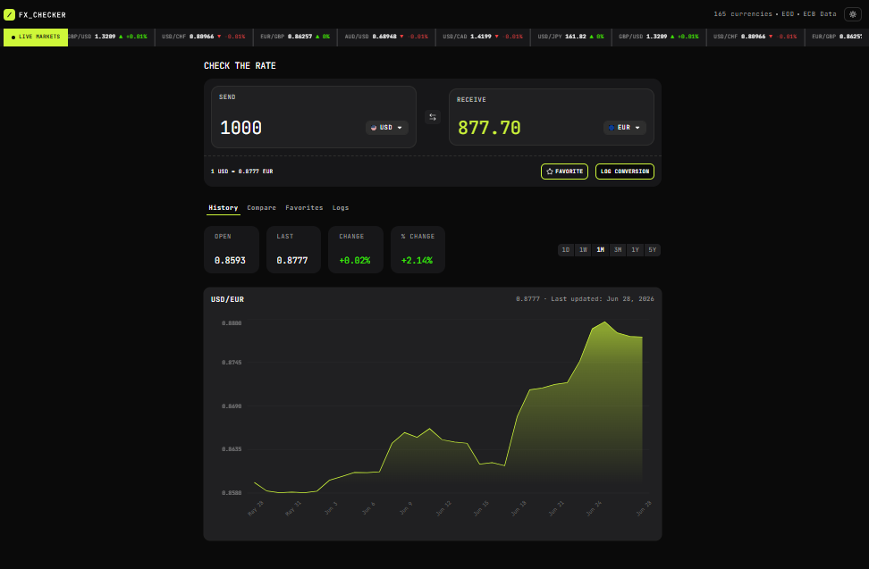
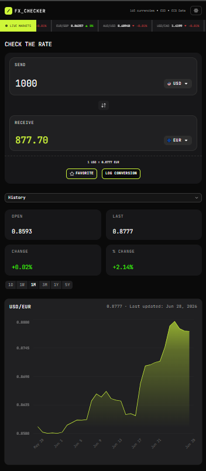

# Foreign Exchange Currency Converter

This is my solution to the [Frontend Mentor FX Checker challenge](https://www.frontendmentor.io/challenges/foreign-exchange-currency-converter). I built a responsive foreign exchange dashboard that lets users convert currencies, compare an amount across multiple currencies, inspect rate history, pin favorite currency pairs, save a local conversion log, and keep using the app with cached data when the connection drops.

I used the [Frankfurter API](https://api.frankfurter.dev/v2) as the exchange-rate data source. In my local environment, the API base URL is stored as `NEXT_PUBLIC_API_URL=https://api.frankfurter.dev/v2`.

## Table of Contents

- [Overview](#overview)
- [Screenshots](#screenshots)
- [Links](#links)
- [Features](#features)
- [Offline and PWA Support](#offline-and-pwa-support)
- [Built With](#built-with)
- [How I Structured the Project](#how-i-structured-the-project)
- [My Implementation Notes](#my-implementation-notes)
- [Getting Started](#getting-started)
- [Available Scripts](#available-scripts)
- [Environment Variables](#environment-variables)
- [Accessibility Notes](#accessibility-notes)
- [What I Learned](#what-i-learned)
- [Continued Development](#continued-development)
- [Author](#author)

## Overview

The goal of this project was to build a realistic currency conversion app with live data and several connected pieces of UI. I wanted the app to feel more like a small financial dashboard than a single converter form, so I focused on keeping the converter, chart, comparison list, favorites, and logs connected through the same currency state.

My main goals were:

- Build a responsive dashboard that works well on mobile and desktop.
- Fetch live exchange-rate data from Frankfurter.
- Keep the current converter state in the URL.
- Use persisted client state for favorites and conversion logs.
- Practice organizing a larger React/Next.js project by feature area.
- Add useful loading, empty, and error states instead of leaving broken UI.
- Keep the UI keyboard-friendly and semantically structured where possible.

## Screenshots

### Desktop



### Mobile



## Links

- Solution URL: [Frontend Mentor solution](https://www.frontendmentor.io/solutions/foreign-exchange-currency-converter-I8o0Vj3M0D)
- Live Site URL: [Vercel deployment](https://repro-foreign-exhange-curency-conve.vercel.app/)
- Repository: [repro123/foreing-exhange-curency-converter](https://github.com/repro123/foreing-exhange-curency-converter.git)

## Features

### Currency Converter

- I built the main converter around a send amount, send currency, and receive currency.
- The default conversion state is `USD` to `EUR` with an amount of `1000`.
- The converted value is calculated from the current exchange rate returned by the API.
- The amount input updates the URL after a short debounce, which avoids pushing a new route on every keystroke.
- The active pair can be swapped with the swap button.
- I added an `Alt+S` keyboard shortcut for swapping currencies.
- The selected pair can be added to favorites.
- The current conversion can be saved to the conversion log.

### Currency Picker

- I used a searchable combobox for currency selection.
- Currencies are split into `Popular` and `Other Currencies`.
- Each option shows the flag, currency code, and currency name.
- The picker prevents selecting the same currency as both the send and receive currency.
- Popular currencies are defined in `src/data/constants.js`.

### Live Market Ticker

- I added a horizontal market ticker above the main dashboard.
- The ticker uses predefined pairs from `src/data/constants.js`.
- It compares the current rate with the previous day's rate to show percentage movement.
- The ticker animation pauses on hover so users can inspect a pair more easily.

The ticker pairs currently include:

- `USD/JPY`
- `GBP/USD`
- `USD/CHF`
- `EUR/GBP`
- `AUD/USD`
- `USD/CAD`

### History View

- I built a rate-history panel for the active currency pair.
- The chart supports `1D`, `1W`, `1M`, `3M`, `1Y`, and `5Y` ranges.
- Longer ranges use grouped API data:
  - `1Y` uses weekly grouping.
  - `5Y` uses monthly grouping.
- I used Recharts to render the area chart.
- The chart includes a custom tooltip.
- The panel displays summary cards for open rate, last rate, change, and percentage change.
- If no history data is available, the UI shows an empty state instead of a broken chart.

### Compare View

- I added a multi-currency comparison panel.
- It converts the current send amount into a predefined list of currencies.
- Each row shows the quote currency, flag, converted amount, and reference rate.
- Users can pin comparison rows to favorites.

The comparison currencies currently include:

- `EUR`
- `GBP`
- `USD`
- `NGN`
- `JPY`
- `CAD`
- `AUD`
- `NZD`
- `CNY`
- `INR`
- `AED`
- `SAR`

### Favorites View

- I used Zustand persistence to save pinned currency pairs in the browser.
- Favorite pairs are stored under the `favorite-pairs` storage key.
- Each favorite row shows the live rate and one-day percentage movement.
- Users can load a favorite pair back into the converter.
- Users can remove one favorite or clear all favorites.
- I added an empty state for users who have not pinned any pairs yet.

### Conversion Log

- I used Zustand persistence to save logged conversions in the browser.
- Conversion logs are stored under the `logged-conversions` storage key.
- A log entry stores the source currency, target currency, amount, converted amount, id, and date.
- The app prevents duplicate logs for the same pair and amount combination.
- Users can delete a single log entry.
- Users can clear the full log.
- Users can export their conversion log as a CSV file.
- The log uses a list layout on smaller screens and a table layout on larger screens.

### Theme Support

- I added theme switching with `next-themes`.
- The app uses class-based theme switching.
- Light and dark design tokens are defined in `src/app/globals.css`.
- The theme selector is displayed in a popover and uses radio controls.

### Loading, Empty, and Error States

- I used Suspense fallbacks around server-rendered data sections.
- I added skeleton states for dashboard panels and rows.
- I added empty states for history, comparison, favorites, and logs.
- I added a custom app error boundary in `src/app/error.js`.

## Offline and PWA Support

- The app uses Serwist to register a service worker and provide offline support.
- A dedicated offline fallback page is shown when the app is opened without a connection.
- Cached conversion, comparison, history, ticker, and currency data can be shown when fresh network data is unavailable.
- A small network status banner informs the user when the app is running from saved data.
- The offline experience keeps the main dashboard usable instead of failing completely when the network drops.

## Built With

- [Next.js](https://nextjs.org/) 16 App Router
- [React](https://react.dev/) 19
- [Tailwind CSS](https://tailwindcss.com/) 4
- [Frankfurter API](https://api.frankfurter.dev/v2) for exchange-rate data
- [Zustand](https://zustand.docs.pmnd.rs/) for persisted client state
- [Recharts](https://recharts.org/) for the history chart
- [next-themes](https://github.com/pacocoursey/next-themes) for theme switching
- [Serwist](https://serwist.pages.dev/) for PWA and offline support
- [Base UI](https://base-ui.com/) primitives
- [shadcn](https://ui.shadcn.com/) and local UI components
- [Lucide React](https://lucide.dev/) and custom SVG icons
- Local JetBrains Mono variable font
- WebP flag assets stored in `public/flags`

## How I Structured the Project

I organized the app by feature instead of putting everything into a few large component files. That made the dashboard easier to reason about as it grew.

```text
src/
  app/
    error.js
    globals.css
    layout.js
    page.js
  assets/
    images/
  components/
    layout/
    SVGs/
    ui/
  data/
    constants.js
  features/
    check-rates/
    compare/
    currencies-number/
    favorites/
    history/
    history-chart-components/
    logs/
    scrolling-ticker/
    tabs/
    theme/
  hooks/
    useCurrencyParams.js
  lib/
    compare-rates.js
    currencies.js
    exchange-rate.js
    live-market.js
    serverApi.js
    time-series.js
    utils.js
  store/
    useFavoritesStore.js
    useLogsStore.js
public/
  desktop-screenshot.png
  mobile-screenshot.png
  flags/
```

The main idea behind the structure:

- `features/` holds UI and logic for each dashboard feature.
- `components/ui/` holds reusable low-level UI primitives.
- `components/layout/` holds shared layout sections.
- `lib/` holds API and formatting helpers.
- `store/` holds persisted client state.
- `data/constants.js` holds fixed lists such as market pairs, popular currencies, comparison currencies, and history periods.

## My Implementation Notes

### URL-Driven State

I used search params for the main dashboard state:

- `from` controls the send currency.
- `to` controls the receive currency.
- `amount` controls the send amount.
- `period` controls the history chart range.
- `tab` controls the active dashboard tab.

This made the app feel more stable on refresh because the main state is not hidden inside component state only. It also makes the current conversion view easier to share.

### Frankfurter API Data Layer

All API requests go through `src/lib/serverApi.js`. That helper reads the base URL and provider setting from environment variables, then the feature-specific helpers build on top of it.

The API base URL I used is:

```env
NEXT_PUBLIC_API_URL=https://api.frankfurter.dev/v2
```

The project also reads:

```env
NEXT_PUBLIC_API_PROVIDER=ALL
```

When `NEXT_PUBLIC_API_PROVIDER` is set to `ALL`, the helper does not append a provider filter. If a different provider value is used, the helper appends it as a `providers` query parameter.

The main data helpers are:

- `getCurrencies()` for the currency list.
- `getSingleCurrency()` for one currency's metadata.
- `getExchangeRate()` for the converter pair.
- `getLiveMarketRates()` for the ticker and favorites.
- `getCompareRates()` for the comparison panel.
- `getTimeSeries()` for historical chart data.

### Caching and Revalidation

I used Next.js `fetch` revalidation options in the API helpers:

- Currency metadata revalidates every 24 hours.
- Market data, comparison data, and time-series data revalidate hourly.
- Single exchange-rate lookups use a shorter revalidation time.

This keeps the UI reasonably fresh without treating every request the same way.

### Persisted Client State

I used Zustand's `persist` middleware for browser-only state:

- Favorites persist under `favorite-pairs`.
- Logs persist under `logged-conversions`.

Both stores include a hydration flag. This helps avoid rendering persisted counts before the browser has loaded the saved state.

### Offline and Cached Data Strategy

The app also uses client-side caching and a service worker so it can remain useful when connectivity drops:

- Recent exchange-rate, comparison, history, ticker, and currency data are cached in the browser.
- Offline requests fall back to the last known saved data instead of showing a blank screen.
- The app surfaces a banner and cached-data notice so users understand when they are viewing stored information.

### Responsive Navigation

For the dashboard panels, I used:

- Tabs on medium and larger screens.
- A select control on smaller screens.

This kept the mobile layout cleaner while still giving desktop users quick access to each panel.

### Styling Approach

I used Tailwind CSS with custom properties defined in `src/app/globals.css`. The stylesheet includes:

- Light theme tokens.
- Dark theme tokens.
- Typography utility presets.
- Tailwind theme mappings.
- Ticker animation.
- Number input normalization.

Using tokens made theme switching easier because most components can depend on semantic values like `background`, `foreground`, `card`, `primary`, and `nav`.

## Getting Started

### Prerequisites

You will need:

- Node.js installed locally
- pnpm installed locally
- A `.env.local` file with the required API variables

This project uses `pnpm`, based on the included `pnpm-lock.yaml` and `pnpm-workspace.yaml`.

### Installation

Install dependencies:

```bash
pnpm install
```

Create `.env.local` in the project root and add:

```env
NEXT_PUBLIC_API_URL=https://api.frankfurter.dev/v2
NEXT_PUBLIC_API_PROVIDER=ALL
```

Run the development server:

```bash
pnpm dev
```

Then open:

```text
http://localhost:3000
```

## Available Scripts

```bash
pnpm dev
```

Runs the local Next.js development server.

```bash
pnpm build
```

Creates a production build.

```bash
pnpm start
```

Starts the production server after a successful build.

```bash
pnpm lint
```

Runs ESLint for the project.

## Environment Variables

The app expects these public environment variables:

```env
NEXT_PUBLIC_API_URL=https://api.frankfurter.dev/v2
NEXT_PUBLIC_API_PROVIDER=ALL
```

`NEXT_PUBLIC_API_URL` is the Frankfurter API base URL.

`NEXT_PUBLIC_API_PROVIDER` controls whether a provider filter is added to API requests. In this project I use `ALL`, so the request helper does not append a provider filter.

## Accessibility Notes

I tried to make the interface usable beyond pointer-only interaction:

- The amount input has a screen-reader-only label.
- The swap button has an accessible label and title.
- The swap button supports the `Alt+S` shortcut.
- The currency picker uses a combobox pattern.
- Duplicate currency choices are disabled with explanatory labels.
- History period buttons have descriptive `aria-label` values.
- The Recharts chart uses `accessibilityLayer`.
- Favorite rows have descriptive link and remove-button labels.
- Empty states communicate what is happening when a panel has no data.

A full manual accessibility audit would still be a useful next step, especially with keyboard-only navigation and screen reader testing.

## What I Learned

This project pushed me to think more carefully about state boundaries. Some state belongs in the URL, some belongs on the server, and some belongs only in the browser. Keeping those responsibilities separate made the app easier to extend.

The biggest lessons for me were:

- URL search params are useful for dashboard state that should survive refreshes.
- Persisted Zustand stores are a good fit for local-only user data like favorites and logs.
- Server-side helpers keep API logic out of UI components.
- Loading, empty, and error states need to be planned as part of the feature, not added at the very end.
- A feature-based folder structure helps keep a growing React app more maintainable.

## Continued Development

Things I would like to improve or explore next:

- Add automated tests for stores, URL parameter updates, and formatting helpers.
- Add integration tests for the main converter flow.
- Improve fallback behavior when the Frankfurter API is unavailable.
- Add a cached last-known-good rate state for failed network requests.
- Improve CSV export escaping if log values ever become more complex.
- Add a formal `.env.example` file for easier setup.
- Run a full accessibility audit with keyboard navigation and screen reader testing.

## Author

- Frontend Mentor: [@repro123](https://www.frontendmentor.io/profile/repro123)
- GitHub: [@repro123](https://github.com/repro123)
- Twitter: [@Dr_Repro](https://x.com/Dr_Repro)
